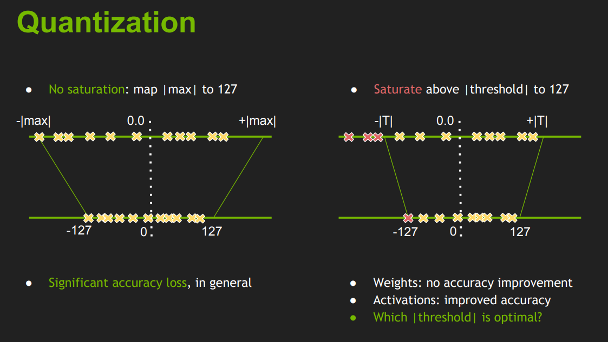
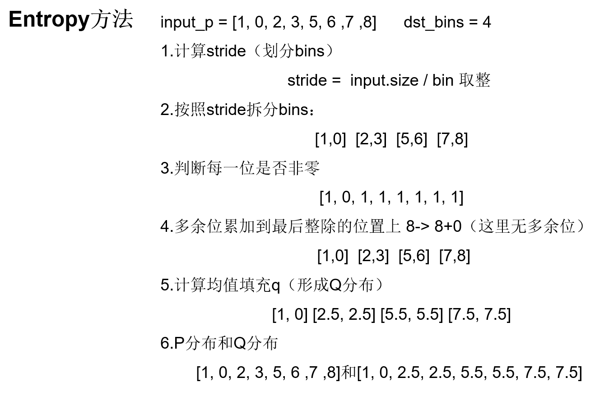

# KL散度量化
前面介绍的非对称量化中，是将数据中的min值和max值直接映射到[-128, 127]。
同样的，前面介绍的对称量化是将数据的最大绝对值$|max|$直接映射到127。  
上面两种直接映射的方法比较粗暴，而TensorRT中的int8量化是基于KL散度来选取最佳的阈值T来映射到127中。超出阈值$\pm|T|$的数据会直接映射为阈值（类似于截断映射）。
<div align=center>

</div>

# KL散度定义
KL散度常用来衡量两个分布P和Q之间的差异，KL散度越小，两个分布越相似，其公式定义如下:
$$D_{KL} = \sum_{i}P(x_i)log(\frac{P(x_i)}{Q(x_i)})$$

# TensorRT实现KL散度量化的步骤
1. 基于原始输入数据生成拥有2048个bin的直方图
```python
hist, bin_edges = np.histogram(P, bins = 2048)
```
2. 在[128, 2048]返回内循环执行3-5步，寻找最佳的划分$bin_{i}$
3. $[0,bin{i}]$范围内的直方图数据作为原始P, 并将$bin_{i}$之后的直方图数据进行求和，并累加到$bin_{i-1}$中形成以$bin_{i}$作为划分的最终P分布
4. 对P分布进行量化形成Q分布(一般是划分和合并bins，计算合并后的平均值作为Q分布对应bins的值)
<div align=center>

</div>
5. 计算P分布和Q分布的KL散度
6. 根据最小的KL散度来选取最佳的$bin_{best}$，将bin_edges[$bin_{best}$]作为最终的阈值threshold，即映射到127的阈值T
7. 根据最佳的阈值T来计算scale
$$scale = \frac{T}{int_{max}} = \frac{T}{127}$$ 
8. 根据对称量化来量化原始数据（权重、激活值等等）

# TensorRT使用KL散度量化的目的
通过KL散度选取合适的阈值T，根据阈值计算对应的缩放系数scale，力求int8量化后的数值能更准确表示出量化前的FP32数值。
