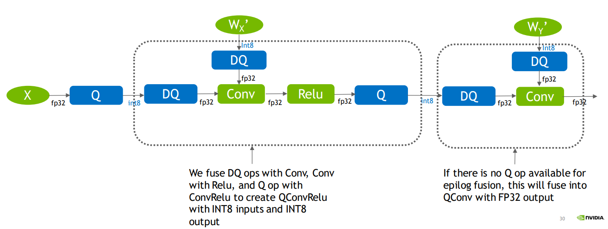

# PTQ量化
PTQ量化表示训练后量化（Post Training Quantization）。使用一批校准数据对训练好的模型进行校准，将训练好的FP32网络直接转换为定点计算的网络，过程中无需对原始模型进行任何训练，而只对几个超参数调整就可完成量化过程。（计算每一层的scale）
```
TensorRT提供的PTQ算法包括：EntropyCalibratorV2、MinMaxCalibrator、EntropyCalibrator和LegacyCalibrator。
通过上述算法进行量化时，TensorRT会在优化网络时尝试使用INT8精度。当某一层在INT8进度下速度优于默认精度，则会优先使用INT8。
由于TensorRT是以速度为优先的，因此用户无法控制某一层的精度。
同时TensorRT还会进行图优化，当一个OP设置为Int8精度，但其与另一个OP合并会导致速度更快时，TensorRT就会将两个OP合并，并忽略用户设置的INT8精度。
```
# QAT量化
QAT量化表示量化感知训练（Quantization Aware Training），将训练过的模型进行量化并再训练。  
使用QAT量化时，会为权重值和激活值插入Q节点（量化节点，FP32→INT8）和DQ节点（反量化节点，INT8→FP32）来模拟量化的过程。  
TensorRT在QAT量化时会插入FQ算子，其作用是将输入先进行量化为INT8，再反量化为FP32，在逻辑上表现为QDQ节点。
<div align=center>


</div>

```
插入QDQ节点后，QDQ节点会模拟量化和反量化的过程，并记录对应的scale和zero_point等信息。  
导出带有QDQ节点的模型为ONNX后，在TensorRT解析上述ONNX模型时，会动态调用Q节点和DQ节点的位置。   
尽管最后所有的Q节点和DQ节点会形成匹对，但不同位置的Q节点和DQ节点会造成一定的精度损失。  
此外，TensorRT还会将某些OP与插入的Q节点和DQ节点进行融合，形成对应的Q算子和DQ算子。
```

<div align=center>


</div>

TensorRT一般遵循的优化规则是: 尽可能将DQ算子推迟，推迟反量化操作和尽可能将Q算子提前，提前量化操作。即让INT8的范围尽可能大，提高推理速度。  
TensorRT在优化网络的时候会把CONV、BN、RELU算子一同合并，来加快推理速度。

