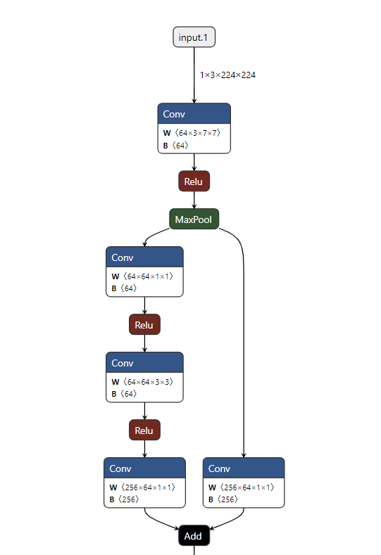
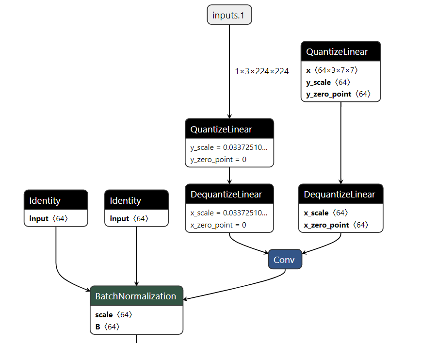
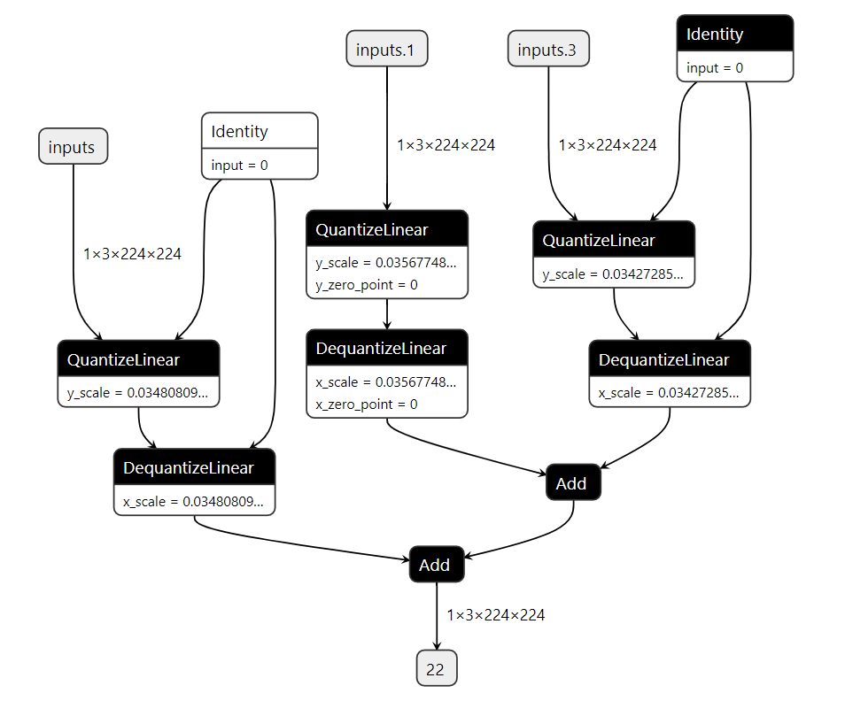

# pytorch-quantization
通过以下命令安装pytorch-quantization:
```bash
pip install pytorch-quantization --extra-index-url https://pypi.ngc.nvidia.com
```
如果安装失败，可以尝试以下安装方式:
```bash
pip3 install sphinx-glpi-theme
pip3 install prettytable # 缺什么库补什么库
pip3 install pytorch-quantization -i https://pypi.ngc.nvidia.com
```

# 分析fake_tensor_quant
简单测试代码如下:
```python
import torch
from pytorch_quantization import tensor_quant

if __name__ == "__main__":
    torch.manual_seed(123456)
    x = torch.rand(10)
    fake_x = tensor_quant.fake_tensor_quant(x, x.abs().max()) # 传入输入数据及其最大的绝对值
    print(x)
    print(fake_x)

# 某次测试结果
# tensor([0.5043, 0.8178, 0.4798, 0.9201, 0.6819, 0.6900, 0.6925, 0.3804, 0.4479, 0.4954])
# tensor([0.5071, 0.8187, 0.4782, 0.9201, 0.6810, 0.6883, 0.6955, 0.3840, 0.4492, 0.4927])
```
从上面的测试结果可知，量化前后的数据存在一定的误差，fake_tensor_quant的执行流程为:
```python
def forward(ctx, inputs, amax, num_bits=8, unsigned=False, narrow_range=True):
    ctx.save_for_backward(inputs, amax)
    outputs, scale = _tensor_quant(inputs, amax, num_bits, unsigned, narrow_range)
    return outputs / scale.to(inputs.dtype)

# 先根据传入的inputs和amax计算量化的结果outputs, 并返回缩放因子scale
# 再基于量化结果和缩放因子进行反量化，返回反量化的结果
# _tensor_quant()的源代码如下:

def _tensor_quant(inputs, amax, num_bits=8, unsigned=False, narrow_range=True):
    """Shared function body between TensorQuantFunction and FakeTensorQuantFunction"""
        # Fine scale, per channel scale will be handled by broadcasting, which could be tricky. Pop a warning.
    if isinstance(amax, torch.Tensor) and inputs.dim() != amax.dim():
        logging.debug("amax %s has different shape than inputs %s. Make sure broadcast works as expected!",
                      amax.size(), inputs.size())

    logging.debug("{} bits quantization on shape {} tensor.".format(num_bits, inputs.size()))

    if unsigned:
        if inputs.min() < 0.:
            raise TypeError("Negative values encountered in unsigned quantization.")

    # Computation must be in FP32 to prevent potential over flow.
    input_dtype = inputs.dtype
    if inputs.dtype == torch.half:
        inputs = inputs.float()
    if amax.dtype == torch.half:
        amax = amax.float()

    min_amax = amax.min()
    if min_amax < 0:
        raise ValueError("Negative values in amax")

    max_bound = torch.tensor((2.0**(num_bits - 1 + int(unsigned))) - 1.0, device=amax.device)
    if unsigned:
        min_bound = 0
    elif narrow_range:
        min_bound = -max_bound
    else:
        min_bound = -max_bound - 1
    scale = max_bound / amax

    epsilon = 1. / (1<<24)
    if min_amax <= epsilon:  # Treat amax smaller than minimum representable of fp16 0
        zero_amax_mask = (amax <= epsilon)
        scale[zero_amax_mask] = 0  # Value quantized with amax=0 should all be 0

    outputs = torch.clamp((inputs * scale).round_(), min_bound, max_bound)

    if min_amax <= epsilon:
        scale[zero_amax_mask] = 1.  # Return 1 makes more sense for values quantized to 0 with amax=0

    if input_dtype == torch.half:
        outputs = outputs.half()

    return outputs, scale

# 核心代码就三行:
max_bound = torch.tensor((2.0**(num_bits - 1 + int(unsigned))) - 1.0, device=amax.device) # 计算max_bound，这里默认是8位因此是127
scale = max_bound / amax # 计算scale
outputs = torch.clamp((inputs * scale).round_(), min_bound, max_bound) # 量化并截断（防止溢出）
```
# 导出ONNX模型
```python
import torch
import torchvision

if __name__ == "__main__":
    model = torchvision.models.resnet50()
    model.cuda()
    inputs = torch.randn(1, 3, 224, 224, device = 'cuda')
    torch.onnx.export(model, inputs, 'quant_resnet50_replace_to_quantization.onnx', opset_version=13)
```
<div align=center>

</div>

# 自动插入QDQ结点
通过调用 quant_modules.initialize() 来将模型中的所有结点插入QDQ算子，Q即量化，DQ即反量化。
```python
import torch
import torchvision
from pytorch_quantization import quant_modules
from pytorch_quantization import nn as quant_nn

if __name__ == "__main__":

    quant_modules.initialize()
    model = torchvision.models.resnet50()
    model.cuda()
    inputs = torch.randn(1, 3, 224, 224, device = 'cuda')
    quant_nn.TensorQuantizer.use_fb_fake_quant = True
    torch.onnx.export(model, inputs, 'quant_resnet50_.onnx', opset_version = 13)
```
<div align=center>

</div>

# 手动插入QDQ节点
通过调用replace_to_quantization_module()函数来手动将模型中的某一层插入QDQ节点。  
disable_quantization() 用于禁用模型中某一块的QDQ节点。  
enable_quantization() 用于启用模型中某一块的QDQ节点。
```python
import torch
import torchvision
from pytorch_quantization import calib
from typing import List, Callable, Union
from pytorch_quantization import quant_modules
from pytorch_quantization import nn as quant_nn
from pytorch_quantization.nn.modules import _utils as  quant_nn_utils

# 禁用某一块的 QDQ 节点
class disable_quantization:
    def __init__(self, model):
        self.model  = model

    def apply(self, disabled=True):
        for name, module in self.model.named_modules():
            if isinstance(module, quant_nn.TensorQuantizer):
                module._disabled = disabled

    def __enter__(self):
        self.apply(True)

    def __exit__(self, *args, **kwargs):
        self.apply(False)

# 启用某一块的 QDQ 节点
class enable_quantization:
    def __init__(self, model):
        self.model  = model

    def apply(self, enabled=True):
        for name, module in self.model.named_modules():
            if isinstance(module, quant_nn.TensorQuantizer):
                module._disabled = not enabled

    def __enter__(self):
        self.apply(True)
        return self

    def __exit__(self, *args, **kwargs):
        self.apply(False)

def quantizer_state(module):
    for name, module in module.named_modules():
        if isinstance(module, quant_nn.TensorQuantizer):
            print(name, module)

# 将原始模型的一个层转换成对应的量化层
def transfer_torch_to_quantization(nninstance : torch.nn.Module, quantmodule):

    quant_instance = quantmodule.__new__(quantmodule)
    for k, val in vars(nninstance).items():
        setattr(quant_instance, k, val)

    def __init__(self):
      
        if isinstance(self, quant_nn_utils.QuantInputMixin):
            quant_desc_input = quant_nn_utils.pop_quant_desc_in_kwargs(self.__class__,input_only=True)
            self.init_quantizer(quant_desc_input)

            # Turn on torch_hist to enable higher calibration speeds
            if isinstance(self._input_quantizer._calibrator, calib.HistogramCalibrator):
                self._input_quantizer._calibrator._torch_hist = True
        else:
            quant_desc_input, quant_desc_weight = quant_nn_utils.pop_quant_desc_in_kwargs(self.__class__)
            self.init_quantizer(quant_desc_input, quant_desc_weight)

            # Turn on torch_hist to enable higher calibration speeds
            if isinstance(self._input_quantizer._calibrator, calib.HistogramCalibrator):
                self._input_quantizer._calibrator._torch_hist = True
                self._weight_quantizer._calibrator._torch_hist = True

    __init__(quant_instance)
    return quant_instance

# 将原始模型中的指定层替换成对应的量化层，并返回替换后的模型
def replace_to_quantization_module(model : torch.nn.Module, ignore_policy : Union[str, List[str], Callable] = None):

    module_dict = {}
    for entry in quant_modules._DEFAULT_QUANT_MAP:
        module = getattr(entry.orig_mod, entry.mod_name)
        module_dict[id(module)] = entry.replace_mod

    def recursive_and_replace_module(module, prefix = ""):
        for name in module._modules:
            submodule = module._modules[name]
            path = name if prefix == "" else prefix + "." + name
            recursive_and_replace_module(submodule, path)

            submodule_id = id(type(submodule))
            if submodule_id in module_dict:  
                module._modules[name] = transfer_torch_to_quantization(submodule, module_dict[submodule_id])

    recursive_and_replace_module(model)

if __name__ == "__main__":
    model = torchvision.models.resnet50()
    model.cuda()
    replace_to_quantization_module(model.layer1) # 手动在 layer1 中插入 QDQ 节点
    # disable_quantization(model.conv1).apply() # 注销某一块的 QDQ 结点
    # enable_quantization(model.conv1).apply() # 启用某一块的 QDQ 结点

    inputs = torch.randn(1, 3, 224, 224, device = 'cuda')
    quant_nn.TensorQuantizer.use_fb_fake_quant = True
    torch.onnx.export(model, inputs, 'mutual_quant_resnet50.onnx', opset_version = 13)
```

# 自定义层量化
```python
import torch
from pytorch_quantization import nn as quant_nn
from pytorch_quantization.tensor_quant import QuantDescriptor

class QuantMultiAdd(torch.nn.Module):
    def __init__(self):
        super().__init__()
        self._input_quantizer = quant_nn.TensorQuantizer(QuantDescriptor(num_bits=8, calib_method="histgoram"))
    
    def forward(self, x, y, z):
        return self._input_quantizer(x) + self._input_quantizer(y) + self._input_quantizer(z)

if __name__ == "__main__":
    model = QuantMultiAdd()
    model.cuda()
    input_a = torch.randn(1, 3, 224, 224, device='cuda')
    input_b = torch.randn(1, 3, 224, 224, device='cuda')
    input_c = torch.randn(1, 3, 224, 224, device='cuda')
    quant_nn.TensorQuantizer.use_fb_fake_quant = True
    torch.onnx.export(model, (input_a, input_b, input_c), 'quantMultiAdd.onnx', opset_version = 13)
```
<div align=center>

</div>

# 完整流程
```
1. 定义模型
2. 对模型插入 DQD 节点
3. 统计 DQD 节点的 range 和 scale
4. 进行敏感层分析，判断哪些层对模型的精度影响最大
5. 导出带 DQD 节点的 PTQ 模型
6. 对模型进行 Finetune 得到QAT模型
```
