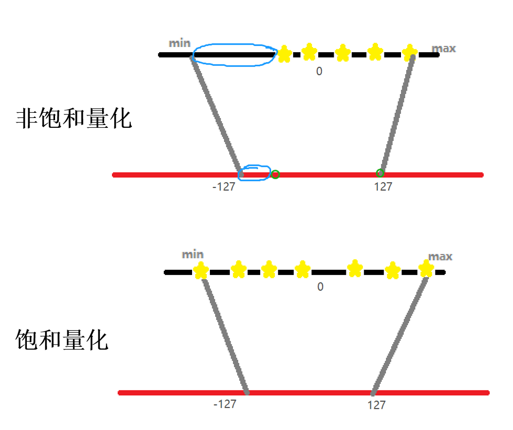

# 1--量化映射
量化映射的通用公式为: $r = S(q - Z)$  
其中r表示量化前数据的真实值，S表示缩放因子，q表示量化后的数值，Z表示零点

# 2--非对称量化
非对称量化需要一个偏移量Z来完成零点的映射，即量化前的零点和量化后的零点不一致。
非对称量化的一般公式为:  
1.计算缩放因子S和偏移量Z
$$S = \frac{r_{max} - r_{min}}{q_{max} - q_{min}}$$
$$Z = q_{max} - Round(\frac{r_{max}}{S})$$
$r_{max}$和$r_{min}$表示真实数据的最大值和最小值，$q_{max}$和$q_{min}$表示量化后的最大值和最小值，例如uint8就是127和-128。 Round()表示取整，如果是量化为int型。  
2.量化
$$ q = Round(\frac{r}{S} + Z)$$
3.反量化
$$r = (q - Z)*S$$

# 3--对称量化
对称量化在量化前和量化后的零点保持一致，即零点对应，因此无需像非对称量化那样引入一个偏移量Z。  
对称量化的一般公式为:  
1.计算缩放因子
$$S = \frac{|r_{max}|}{|q_{max}|}$$
2.量化
$$q = Round(\frac{r}{S})$$
Round()表示取整，如果是量化为int型。  
3.反量化
$$r = q*S$$

# 4--优缺点分析
对称量化无需引入偏移量Z，因此计算量低，缺点是量化后的数据是非饱和的，即有一部分区域不存在量化的数据。  
非对称量化因为额外引入了一个偏移量来修正零点，因此需要的计算量会大一点。优点是其量化后的数据是饱和的，即量化前的最小值对应量化范围的最小值，量化后的最大值对应量化范围的最大值。

